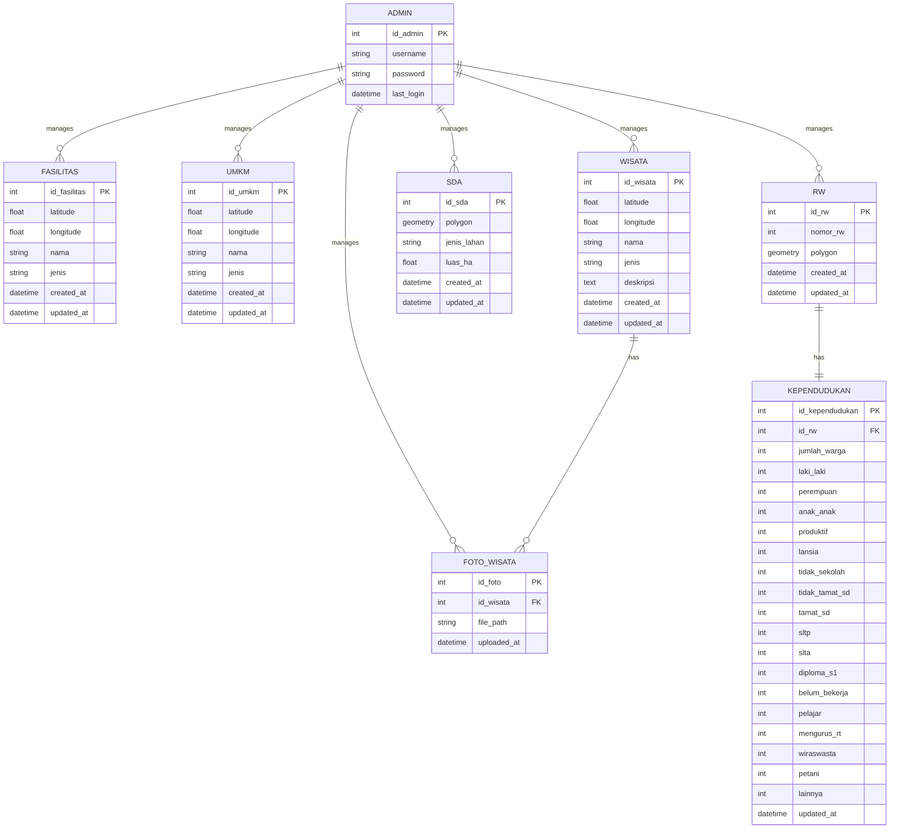
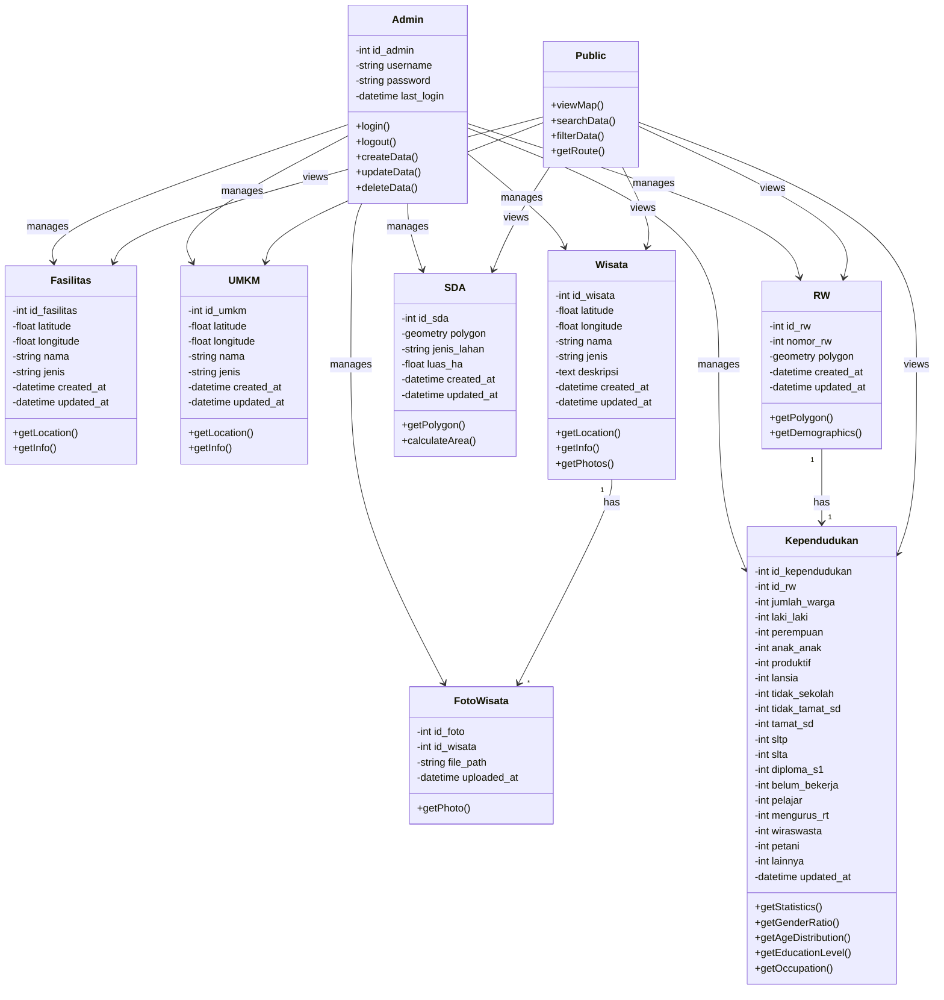

# Database Design - Sistem Informasi Geografis Desa Prawoto

## 1. Tabel Rancangan Hak Akses Pengguna

| Role | Login | View Maps | Search/Filter | CRUD Fasilitas | CRUD UMKM | CRUD Wisata | CRUD SDA | CRUD Kependudukan |
|------|-------|-----------|---------------|----------------|-----------|-------------|----------|-------------------|
| Admin | ✓ | ✓ | ✓ | ✓ | ✓ | ✓ | ✓ | ✓ |
| Public | ✗ | ✓ | ✓ | ✗ | ✗ | ✗ | ✗ | ✗ |

**Keterangan:**
- Admin: Akses penuh untuk login, melihat, menambah, mengubah, dan menghapus semua data
- Public: Hanya dapat melihat peta, melakukan pencarian, filter, dan routing tanpa login

---

## 2. Use Case Diagram

```mermaid
graph TB
    subgraph "Sistem Informasi Geografis Desa Prawoto"
        UC1[Login]
        UC2[Lihat Peta Fasilitas]
        UC3[Lihat Peta UMKM]
        UC4[Lihat Peta Wisata]
        UC5[Lihat Peta SDA]
        UC6[Lihat Peta Kependudukan]
        UC7[Search & Filter]
        UC8[Routing/Navigasi]
        UC9[CRUD Fasilitas]
        UC10[CRUD UMKM]
        UC11[CRUD Wisata]
        UC12[CRUD SDA]
        UC13[CRUD Kependudukan]
    end
    
    Admin((Admin))
    Public((Public))
    
    Admin --> UC1
    Admin --> UC2
    Admin --> UC3
    Admin --> UC4
    Admin --> UC5
    Admin --> UC6
    Admin --> UC7
    Admin --> UC8
    Admin --> UC9
    Admin --> UC10
    Admin --> UC11
    Admin --> UC12
    Admin --> UC13
    
    Public --> UC2
    Public --> UC3
    Public --> UC4
    Public --> UC5
    Public --> UC6
    Public --> UC7
    Public --> UC8
```



---

## 3. ERD Konseptual



---

## 4. Diagram Objek (Class Diagram)



---

## 5. Tabel Database Schema

### Tabel: admin
| Column | Type | Constraint | Description |
|--------|------|------------|-------------|
| id_admin | SERIAL | PRIMARY KEY | ID admin (auto increment) |
| username | VARCHAR(50) | UNIQUE, NOT NULL | Username untuk login |
| password | VARCHAR(255) | NOT NULL | Password (hashed) |
| last_login | TIMESTAMP | NULL | Waktu login terakhir |
| created_at | TIMESTAMP | DEFAULT CURRENT_TIMESTAMP | Waktu pembuatan akun |

### Tabel: fasilitas
| Column | Type | Constraint | Description |
|--------|------|------------|-------------|
| id_fasilitas | SERIAL | PRIMARY KEY | ID fasilitas (auto increment) |
| latitude | DECIMAL(10,8) | NOT NULL | Koordinat latitude |
| longitude | DECIMAL(11,8) | NOT NULL | Koordinat longitude |
| nama | VARCHAR(255) | NOT NULL | Nama fasilitas |
| jenis | VARCHAR(100) | NOT NULL | Jenis fasilitas (Pendidikan, Kesehatan, dll) |
| created_at | TIMESTAMP | DEFAULT CURRENT_TIMESTAMP | Waktu pembuatan data |
| updated_at | TIMESTAMP | DEFAULT CURRENT_TIMESTAMP | Waktu update terakhir |

### Tabel: umkm
| Column | Type | Constraint | Description |
|--------|------|------------|-------------|
| id_umkm | SERIAL | PRIMARY KEY | ID UMKM (auto increment) |
| latitude | DECIMAL(10,8) | NOT NULL | Koordinat latitude |
| longitude | DECIMAL(11,8) | NOT NULL | Koordinat longitude |
| nama | VARCHAR(255) | NOT NULL | Nama UMKM |
| jenis | VARCHAR(100) | NOT NULL | Jenis UMKM (Kuliner, Fashion, dll) |
| created_at | TIMESTAMP | DEFAULT CURRENT_TIMESTAMP | Waktu pembuatan data |
| updated_at | TIMESTAMP | DEFAULT CURRENT_TIMESTAMP | Waktu update terakhir |

### Tabel: wisata
| Column | Type | Constraint | Description |
|--------|------|------------|-------------|
| id_wisata | SERIAL | PRIMARY KEY | ID wisata (auto increment) |
| latitude | DECIMAL(10,8) | NOT NULL | Koordinat latitude |
| longitude | DECIMAL(11,8) | NOT NULL | Koordinat longitude |
| nama | VARCHAR(255) | NOT NULL | Nama wisata |
| jenis | VARCHAR(100) | NOT NULL | Jenis wisata (Mata Air, Gunung, dll) |
| deskripsi | TEXT | NULL | Deskripsi wisata |
| created_at | TIMESTAMP | DEFAULT CURRENT_TIMESTAMP | Waktu pembuatan data |
| updated_at | TIMESTAMP | DEFAULT CURRENT_TIMESTAMP | Waktu update terakhir |

### Tabel: foto_wisata
| Column | Type | Constraint | Description |
|--------|------|------------|-------------|
| id_foto | SERIAL | PRIMARY KEY | ID foto (auto increment) |
| id_wisata | INTEGER | FOREIGN KEY REFERENCES wisata(id_wisata) ON DELETE CASCADE | ID wisata terkait |
| file_path | VARCHAR(500) | NOT NULL | Path file foto |
| uploaded_at | TIMESTAMP | DEFAULT CURRENT_TIMESTAMP | Waktu upload foto |

### Tabel: sda
| Column | Type | Constraint | Description |
|--------|------|------------|-------------|
| id_sda | SERIAL | PRIMARY KEY | ID SDA (auto increment) |
| polygon | GEOMETRY(MultiPolygon, 4326) | NOT NULL | Polygon lahan (GeoJSON) |
| jenis_lahan | VARCHAR(50) | NOT NULL | Jenis lahan (Sawah, Kebun, Ladang, Pemukiman) |
| luas_ha | DECIMAL(10,4) | NOT NULL | Luas lahan dalam hektar |
| created_at | TIMESTAMP | DEFAULT CURRENT_TIMESTAMP | Waktu pembuatan data |
| updated_at | TIMESTAMP | DEFAULT CURRENT_TIMESTAMP | Waktu update terakhir |

### Tabel: rw
| Column | Type | Constraint | Description |
|--------|------|------------|-------------|
| id_rw | SERIAL | PRIMARY KEY | ID RW (auto increment) |
| nomor_rw | INTEGER | UNIQUE, NOT NULL | Nomor RW (1-6) |
| polygon | GEOMETRY(MultiPolygon, 4326) | NOT NULL | Polygon batas RW (GeoJSON) |
| created_at | TIMESTAMP | DEFAULT CURRENT_TIMESTAMP | Waktu pembuatan data |
| updated_at | TIMESTAMP | DEFAULT CURRENT_TIMESTAMP | Waktu update terakhir |

### Tabel: kependudukan
| Column | Type | Constraint | Description |
|--------|------|------------|-------------|
| id_kependudukan | SERIAL | PRIMARY KEY | ID kependudukan (auto increment) |
| id_rw | INTEGER | FOREIGN KEY REFERENCES rw(id_rw) ON DELETE CASCADE, UNIQUE | ID RW terkait |
| jumlah_warga | INTEGER | NOT NULL | Total jumlah warga |
| laki_laki | INTEGER | NOT NULL | Jumlah laki-laki |
| perempuan | INTEGER | NOT NULL | Jumlah perempuan |
| anak_anak | INTEGER | NOT NULL | Usia <15 tahun |
| produktif | INTEGER | NOT NULL | Usia 15-64 tahun |
| lansia | INTEGER | NOT NULL | Usia >64 tahun |
| tidak_sekolah | INTEGER | NOT NULL | Tidak/belum sekolah |
| tidak_tamat_sd | INTEGER | NOT NULL | Tidak tamat SD |
| tamat_sd | INTEGER | NOT NULL | Tamat SD/sederajat |
| sltp | INTEGER | NOT NULL | SLTP/sederajat |
| slta | INTEGER | NOT NULL | SLTA/sederajat |
| diploma_s1 | INTEGER | NOT NULL | Diploma IV/Strata I |
| belum_bekerja | INTEGER | NOT NULL | Belum/tidak bekerja |
| pelajar | INTEGER | NOT NULL | Pelajar/mahasiswa |
| mengurus_rt | INTEGER | NOT NULL | Mengurus rumah tangga |
| wiraswasta | INTEGER | NOT NULL | Wiraswasta |
| petani | INTEGER | NOT NULL | Petani/pekebun |
| lainnya | INTEGER | NOT NULL | Pekerjaan lainnya |
| updated_at | TIMESTAMP | DEFAULT CURRENT_TIMESTAMP | Waktu update terakhir |

---

## SQL Script untuk PostgreSQL dengan PostGIS

```sql
-- Enable PostGIS extension
CREATE EXTENSION IF NOT EXISTS postgis;

-- Create admin table
CREATE TABLE admin (
    id_admin SERIAL PRIMARY KEY,
    username VARCHAR(50) UNIQUE NOT NULL,
    password VARCHAR(255) NOT NULL,
    last_login TIMESTAMP NULL,
    created_at TIMESTAMP DEFAULT CURRENT_TIMESTAMP
);

-- Create fasilitas table
CREATE TABLE fasilitas (
    id_fasilitas SERIAL PRIMARY KEY,
    latitude DECIMAL(10,8) NOT NULL,
    longitude DECIMAL(11,8) NOT NULL,
    nama VARCHAR(255) NOT NULL,
    jenis VARCHAR(100) NOT NULL,
    created_at TIMESTAMP DEFAULT CURRENT_TIMESTAMP,
    updated_at TIMESTAMP DEFAULT CURRENT_TIMESTAMP
);

-- Create umkm table
CREATE TABLE umkm (
    id_umkm SERIAL PRIMARY KEY,
    latitude DECIMAL(10,8) NOT NULL,
    longitude DECIMAL(11,8) NOT NULL,
    nama VARCHAR(255) NOT NULL,
    jenis VARCHAR(100) NOT NULL,
    created_at TIMESTAMP DEFAULT CURRENT_TIMESTAMP,
    updated_at TIMESTAMP DEFAULT CURRENT_TIMESTAMP
);

-- Create wisata table
CREATE TABLE wisata (
    id_wisata SERIAL PRIMARY KEY,
    latitude DECIMAL(10,8) NOT NULL,
    longitude DECIMAL(11,8) NOT NULL,
    nama VARCHAR(255) NOT NULL,
    jenis VARCHAR(100) NOT NULL,
    deskripsi TEXT NULL,
    created_at TIMESTAMP DEFAULT CURRENT_TIMESTAMP,
    updated_at TIMESTAMP DEFAULT CURRENT_TIMESTAMP
);

-- Create foto_wisata table
CREATE TABLE foto_wisata (
    id_foto SERIAL PRIMARY KEY,
    id_wisata INTEGER NOT NULL,
    file_path VARCHAR(500) NOT NULL,
    uploaded_at TIMESTAMP DEFAULT CURRENT_TIMESTAMP,
    FOREIGN KEY (id_wisata) REFERENCES wisata(id_wisata) ON DELETE CASCADE
);

-- Create sda table
CREATE TABLE sda (
    id_sda SERIAL PRIMARY KEY,
    polygon GEOMETRY(MultiPolygon, 4326) NOT NULL,
    jenis_lahan VARCHAR(50) NOT NULL,
    luas_ha DECIMAL(10,4) NOT NULL,
    created_at TIMESTAMP DEFAULT CURRENT_TIMESTAMP,
    updated_at TIMESTAMP DEFAULT CURRENT_TIMESTAMP
);

-- Create rw table
CREATE TABLE rw (
    id_rw SERIAL PRIMARY KEY,
    nomor_rw INTEGER UNIQUE NOT NULL,
    polygon GEOMETRY(MultiPolygon, 4326) NOT NULL,
    created_at TIMESTAMP DEFAULT CURRENT_TIMESTAMP,
    updated_at TIMESTAMP DEFAULT CURRENT_TIMESTAMP
);

-- Create kependudukan table
CREATE TABLE kependudukan (
    id_kependudukan SERIAL PRIMARY KEY,
    id_rw INTEGER UNIQUE NOT NULL,
    jumlah_warga INTEGER NOT NULL,
    laki_laki INTEGER NOT NULL,
    perempuan INTEGER NOT NULL,
    anak_anak INTEGER NOT NULL,
    produktif INTEGER NOT NULL,
    lansia INTEGER NOT NULL,
    tidak_sekolah INTEGER NOT NULL,
    tidak_tamat_sd INTEGER NOT NULL,
    tamat_sd INTEGER NOT NULL,
    sltp INTEGER NOT NULL,
    slta INTEGER NOT NULL,
    diploma_s1 INTEGER NOT NULL,
    belum_bekerja INTEGER NOT NULL,
    pelajar INTEGER NOT NULL,
    mengurus_rt INTEGER NOT NULL,
    wiraswasta INTEGER NOT NULL,
    petani INTEGER NOT NULL,
    lainnya INTEGER NOT NULL,
    updated_at TIMESTAMP DEFAULT CURRENT_TIMESTAMP,
    FOREIGN KEY (id_rw) REFERENCES rw(id_rw) ON DELETE CASCADE
);

-- Create indexes for better performance
CREATE INDEX idx_fasilitas_jenis ON fasilitas(jenis);
CREATE INDEX idx_umkm_jenis ON umkm(jenis);
CREATE INDEX idx_wisata_jenis ON wisata(jenis);
CREATE INDEX idx_sda_jenis ON sda(jenis_lahan);
CREATE INDEX idx_sda_polygon ON sda USING GIST(polygon);
CREATE INDEX idx_rw_polygon ON rw USING GIST(polygon);
CREATE INDEX idx_foto_wisata_id ON foto_wisata(id_wisata);
```

---

## Catatan Implementasi

1. **PostGIS Extension**: Diperlukan untuk menyimpan data geometri (polygon) pada tabel `sda` dan `rw`
2. **Password Hashing**: Password admin harus di-hash menggunakan bcrypt atau argon2 sebelum disimpan
3. **Cascade Delete**: Foto wisata akan otomatis terhapus jika data wisata dihapus
4. **Spatial Index**: GIST index pada kolom polygon untuk query spatial yang lebih cepat
5. **Timestamp**: Menggunakan `updated_at` untuk tracking perubahan data
6. **SRID 4326**: Sistem koordinat WGS84 (standar GPS/Google Maps)
